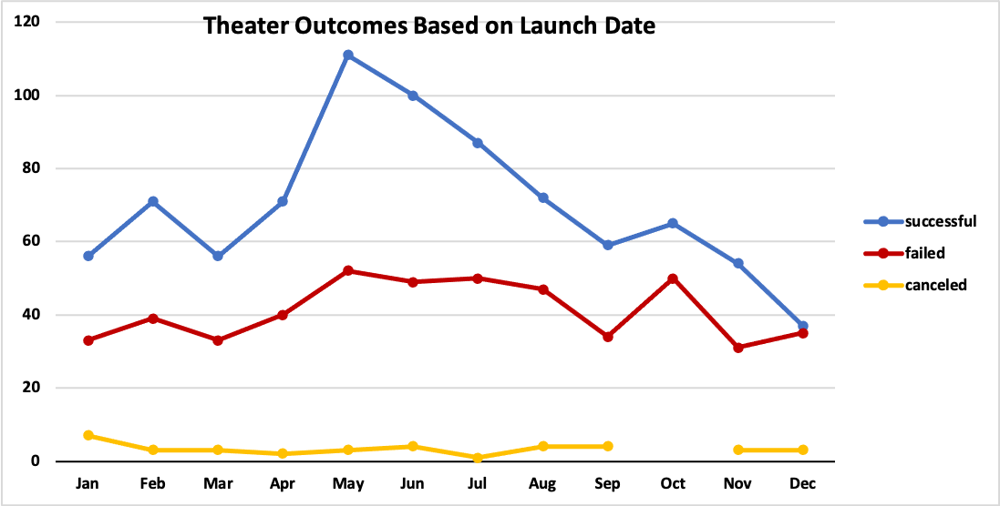
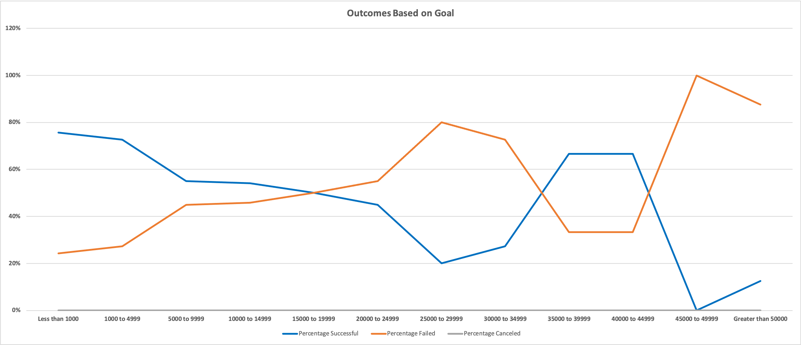

# Kickstarting with Excel

## Overview of Project

In this project, we want to help Louise to understand how different campaigns fared in relation to their launch date and their funding goals. To do so, I used the Kickstarter dataset and visualized campaign outcomes based on the their launch dates and their funding goals.

### Purpose

## Analysis and Challenges

### Analysis of Outcomes Based on Launch Date

This analysis analyzes the campaign outcomes (successful, failed, canceled) based on its launch date. The information is then filtered to choose **Theater** as the Parent Category, then visualized with a Pivot Chart.

### Analysis of Outcomes Based on Goals

This analysis analyzes the percentage of successful, failed, and canceled plays based on the funding goal amount. To achieve it, firstly, I separated the funding goals into twelve different bins and then used the COUNTIFS() and SUM() function to put the numbers into correct bins. Also, for this analysis, I filtered the Subcategory and only used "Plays" as my primary value.

### Challenges and Difficulties Encountered

Overall, I think this is a moderate challenge. At first, I had some difficulties with the analysis of Outcomes Based on Goals (Deliverable 2) because of the COUNTIFS() function. Inside that function, we had to list different ranges for different goals, and that caused me some trouble the most because I made so many typos, which the function could not run. 

With that said, I chose a different approach by utilizing the Fixed Column/Row function ($ sign) and typing down all of my possibles variables into other cells. Then I connected the COUNTIFS() function with those variables, so it became a dynamic function, which also helped me save lots of time. 

## Results

- What are two conclusions you can draw about the Outcomes based on Launch Date?
    - It looks like the most successful month to launch was May. However, after that, the chances of success were reduced significantly, with December being the least successful month to launch. Besides, the chances of being failed during December also high, so this was not a great time to launch.
    - In terms of the number of canceled outcomes, their numbers were low, so I think we do not need to concern about that much. Nevertheless, try to avoid January since it had the highest outcome of being canceled compared to other months.
- What can you conclude about the Outcomes based on Goals?
    - It seems like the Percentage of Successful and the goals amounts have a negative correlation since the higher the goal, the fewer chances that the outcome will be successful. Indeed, the **highest successful percent** happened when the goal amount was **Less than 1000$**, and the **lowest successful percent** (or **highest failed percent**) occurred when the goal amounts were from **$45000 to $49999**.
- What are some limitations of this dataset?
    - It is depended on the purpose of the Data Analytics person. For me, I think this data set misses the **demographic information** of the audience/backers for each campaign, like their age, numbers of female versus male audience. With this extra information, we can tailor our campaign to more specific user groups; thus, hopefully improving the chance of success. 
- What are some other possible tables and/or graphs that we could create?
    - The comparison between Pledged and Goal per Categories: Did the campaign creator set unrealistic goals to achieve or not? 
    - The relationship between Backers Count, Pledged amount, and Spotlight: Does the number of Backers, or the amount of Pledged money is the main factor in determining a Spotlight Campaign, or both?
